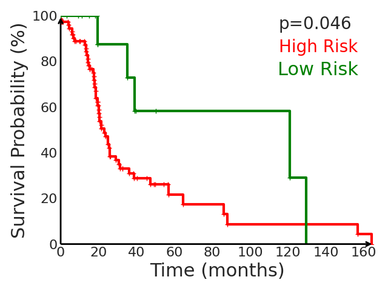

**This work is an implementation of the paper "A Mixture-of-Experts Framework with Log-Logistic Components for Survival Analysis on Histopathology Images".It proposes a modular framework for predicting cancer-specific survival from whole-slide pathology images (WSIs). The method integrates four components:(i) Quantile-Gated Patch Selection via quantile-based thresholding to isolate prognostically informative tissue regions; (ii) Graph-Guided Clustering using $k$-NN graph to capture phenotype-level heterogeneity through spatial–morphological coherence; (iii) Hierarchical Context Attention to learn intra- and inter-cluster interactions; and (iv) an Expert-Driven Mixture of Log-logistics framework to estimate complex survival distributions using Log-logistics distributions. The model attains a concordance index of 0.644±0.059 on TCGA-LUAD, 0.751±0.037 on TCGA-KIRC, and 0.752±0.011 on TCGA-BRCA, respectively, outperforming existing state-of-the-art approaches.**

## 🔄 Pipeline Steps for creating the Virtual Environment

1. Create and activate environment
   ```
   conda create -n sgcmde python=3.9 

   conda activate sgcmll
   ```

2. Install PyTorch (CUDA 11.3 build)
   ```
    pip install torch==1.12.1+cu113 torchvision==0.13.1+cu113 --extra-index-url https://download.pytorch.org/whl/cu113
   ```

3. Install RAPIDS cuDF/cuML
   ```
   pip install --extra-index-url=https://pypi.nvidia.com cudf-cu11==23.10.0 cuml-cu11==23.10.0
   ```

4. Install other Python dependencies
   ```
   pip install tqdm lifelines munch tensorboardX einops h5py seaborn
   ```
5. While running the train script, some errors may appear after creating the virtual environment. If errors appear then follow the steps in the text file 'changes_in_virtual_env_types_python_file.txt' right after the creation of the         virtual environment.
   
## 📂 Data Preparation

1. TCGA data
Download diagnostic WSIs and corresponding clinical metadata from TCGA(https://portal.gdc.cancer.gov/).

2. Patch extraction
Use the CLAM WSI processing tool(https://github.com/mahmoodlab/CLAM) to crop WSIs into 256×256 patches at 20× magnification.

3. Feature extraction
Extract patch-level features with a ViT(https://github.com/lunit-io/benchmark-ssl-pathology#pre-trained-weights) model pretrained on large-scale WSI collections using self-supervised learning.

4. Annoation files and folder structure
Prepare you own 'wsi_annos_vit-s-dino-p16.txt' file.

## 📂 Dataset Structure

```
data/
├── kirc/
│   ├── 5fold_wsi-rnaseq/
│   │   ├── fold1/
│   │   │   ├── train.txt
│   │   │   └── val.txt
│   │   ├── fold2/
│   │   ├── fold3/
│   │   ├── fold4/
│   │   └── fold5/
│   ├── clinical.csv
│   └── wsi_annos_vit-s-dino-p16.txt
└── luad/
    ├── 5fold_wsi-rnaseq/
    │   ├── fold1/
    │   │   ├── train.txt
    │   │   └── val.txt
    │   ├── fold2/
    │   ├── fold3/
    │   ├── fold4/
    │   └── fold5/
    ├── clinical.csv
    └── wsi_annos_vit-s-dino-p16.txt
```
    
## 🧪  Train the model
python train.py --config configs/luad_sgcmll.yaml

## 🌡️ Final Plot
python plot.py --config configs/luad_sgcmll.py
<p align="center">
  
</p>

## 📚 Acknowledgements
Thanks Zekang Yang, Hong Liu, and Xiangdong Wang for the public access of the codebase https://github.com/yang-ze-kang/SCMIL
